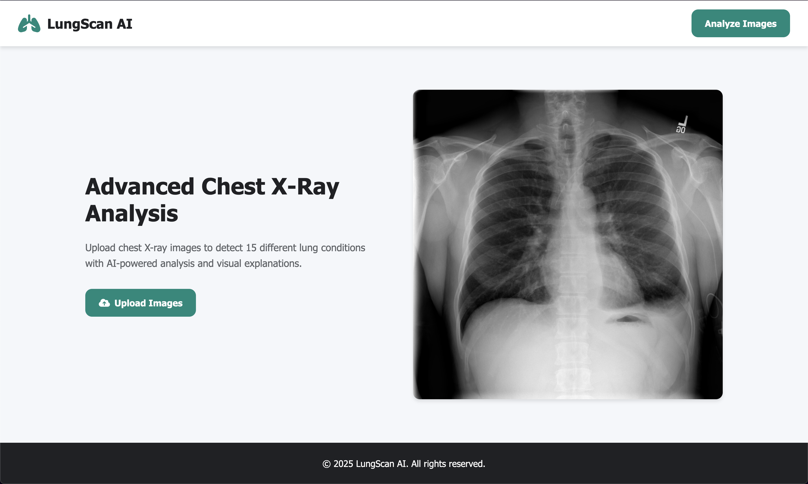
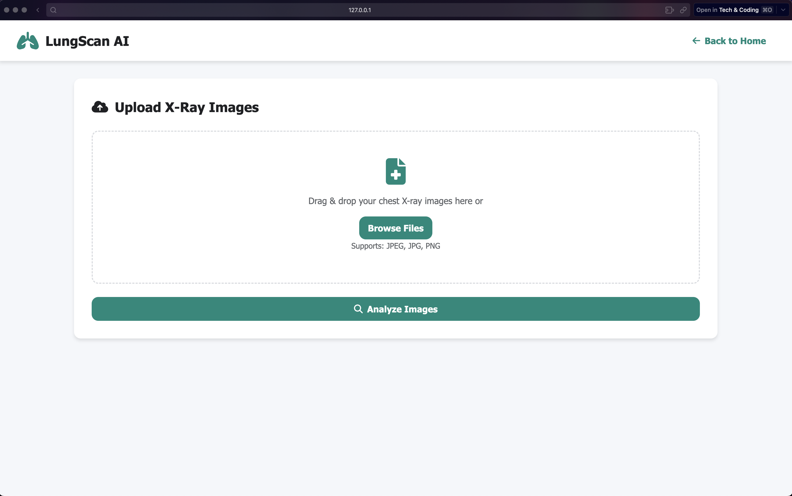
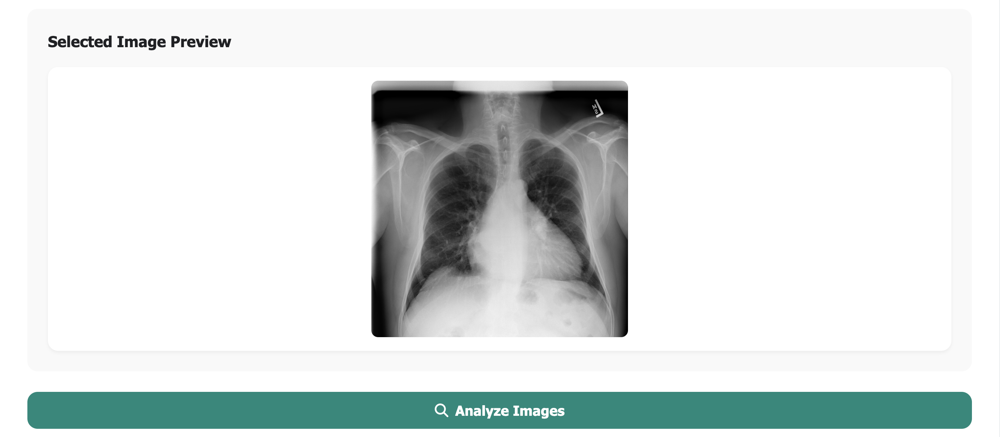
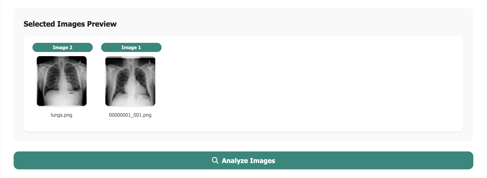
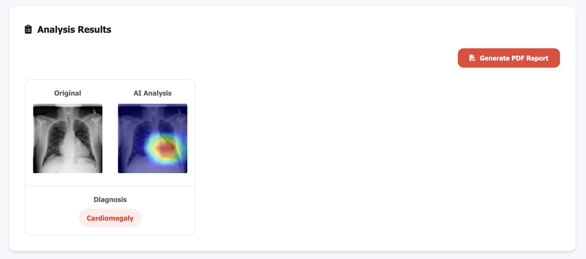
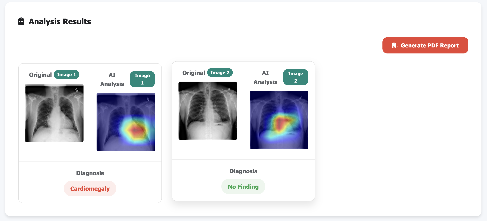
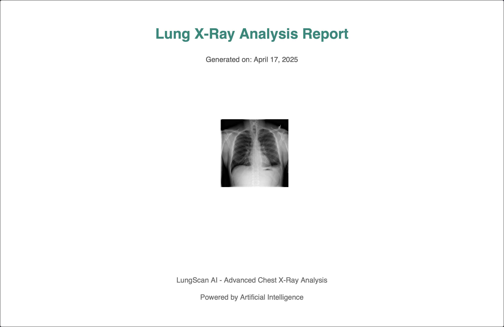
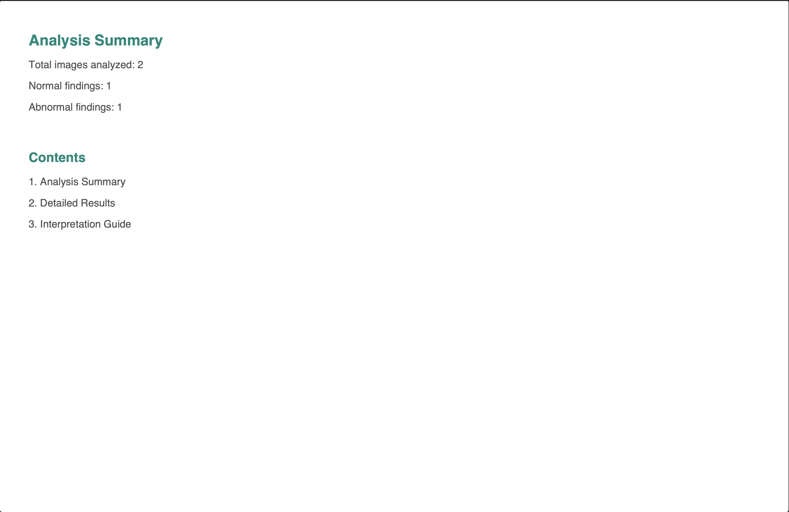
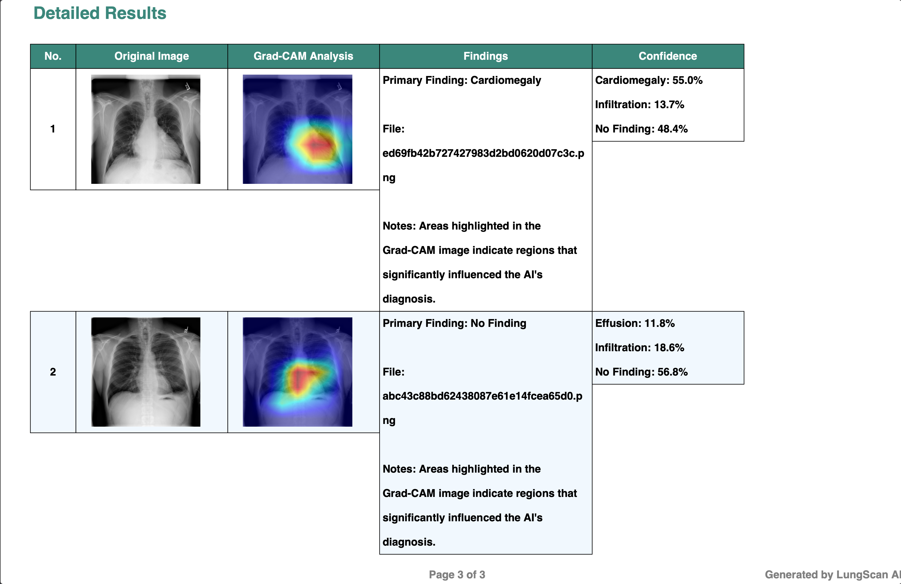
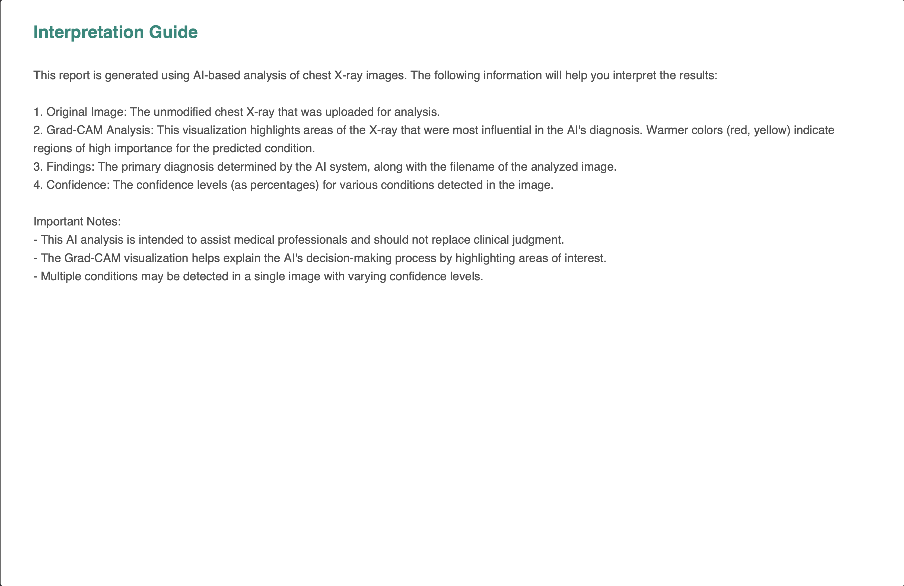

# LungScan AI - Advanced Lung X-Ray Image Classification



### Introduction

LungScan AI is a state-of-the-art web application that performs AI-powered classification of chest X-ray images into 15
distinct lung conditions.
The application features a clean, modern interface and provides comprehensive PDF reports with
Grad-CAM visualizations to explain the model's predictions.

The model predicts 15 classes of lung conditions:

1. Normal (No Finding)
2. Atelectasis
3. Consolidation
4. Infiltration
5. Pneumothorax
6. Edema
7. Emphysema
8. Fibrosis
9. Effusion
10. Pneumonia
11. Pleural thickening
12. Cardiomegaly
13. Nodule
14. Mass
15. Hernia

## Table of Contents

1. [Features](#features)
2. [Technologies Used](#technologies-used)
3. [Setup and Installation](#setup-and-installation)
4. [How to Use](#how-to-use)
5. [Project Structure](#project-structure)
6. [Sample Report](#sample-report)
7. [License](#license)

## Features

1. **Modern Web Interface**
    - Clean, intuitive design
    - Drag-and-drop file upload
    - Real-time image preview

2. **Advanced Analysis**
    - AI-powered classification of 15 lung conditions
    - Grad-CAM visualizations highlighting diagnostic regions
    - Confidence scores for each prediction

3. **Comprehensive Reporting**
    - Professional PDF report generation
    - Detailed analysis summary
    - Visual explanation of results
    - Interpretation guide for users

4. **Technical Features**
    - Batch processing of multiple images
    - Secure file handling
    - Error handling and validation

## Technologies Used

- **Backend**: Flask (Python web framework)
- **Deep Learning**: PyTorch (model training and inference)
- **Computer Vision**: OpenCV, PIL (image processing)
- **Model Explainability**: Grad-CAM (visual explanations)
- **Reporting**: FPDF (PDF generation)
- **Configuration**: YAML, Hydra-Core
- **Frontend**: HTML5, CSS3, JavaScript
- **Environment Management**: Conda (recommended)
- **Tools $ IDE**: Google Colab (model training), PyCharm (Flask app)

## Setup and Installation

### Using Conda (Recommended)

1. **Clone the repository**:
    ```bash
    git clone https://github.com/PiusSunday/Advanced-Lung-X-Ray-Image-Classification.git
    cd Advanced-Lung-X-Ray-Image-Classification
    ```

2. **Create and activate conda environment**:
    ```bash
    conda create -n venv python=3.12
    conda activate venv
    ```

3. **Install dependencies**:
    ```bash
    conda install --file requirements.txt
    ```

4. **Set up environment variables**:
    - Create a **.env** file in the project root with:
    ```bash
    SECRET_KEY=your_secret_key_here
    ```

5. **Run the application**:
   `python main.py`

6. **Access the application**:
   Open your browser to [http://127.0.0.1:5000/](http://localhost:5000).

### How to Use

1. **Upload Images**
   - Drag and drop X-ray images or click "Browse Files"
   - Supported formats: JPEG, JPG, PNG
   - View selected images in the preview panel

   

2. **Analyze Images**
   - Click "Analyze Images" to process uploaded files

   
   

3. **Review Results**
   - See diagnosis with confidence scores
   - Examine Grad-CAM visualizations
   - View highlighted areas of interest

   
   

4. **Generate Report**
   - Click "Generate PDF Report"
   - Download a comprehensive analysis report
   - The Report includes:
     - Original images
     - Grad-CAM visualizations
     - Detailed findings
     - Confidence scores
     - Interpretation guide

### Project Structure

```bash
├── artifacts/                # Trained model weights and artifacts
├── config/                   # Configuration files
│   ├── base.yaml             # Base configuration
│   ├── config.py             # Runtime configuration
│   └── train-config.yaml     # Training configuration
├── notebooks/                # Jupyter notebooks for experimentation
├── src/                      # Core application logic
│   ├── features/             # Feature engineering
│   │   └── inference.py      # Model inference and prediction
│   └── utils/                # Utility functions
│       ├── helpers.py        # Helper functions
│       ├── input_stream.py   # Input validation
│       └── preprocessing.py  # Image preprocessing
├── static/                   # Static assets
│   ├── images/               # Static images
│   ├── uploads/              # User uploads directory
│   ├── home_style.css        # Home page styles
│   └── upload_style.css      # Upload page styles
├── templates/                # HTML templates
│   ├── index.html            # Home page
│   └── upload.html           # Upload/analysis page
├── .env                      # Environment variables
├── .gitignore                # Git ignore rules
├── LICENSE                   # MIT License
├── main.py                   # Flask application entry point
├── README.md                 # Project documentation
└── requirements.txt          # Python dependencies
```

### Sample Report

The application generates comprehensive PDF reports that include:

1. **Analysis Summary**:

   - Number of images analyzed
   - Normal/abnormal findings
   - Confidence scores

2. **Detailed Results**:

   - Original images
   - Grad-CAM visualizations
   - Specific findings for each image
   - Confidence percentage for each condition

3. **Interpretation Guide**:

   - How to read the results
   - Explanation of Grad-CAM visualizations
   - Important notes about AI-assisted diagnosis






### License

This project is licensed under the MIT License—see the [LICENSE](https://github.com/PiusSunday/Advanced-Lung-X-Ray-Image-Classification/blob/main/LICENSE) file for details.
---
